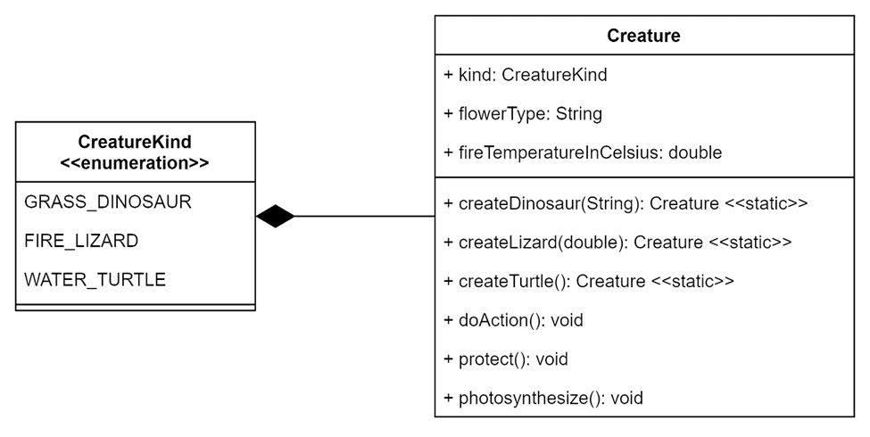
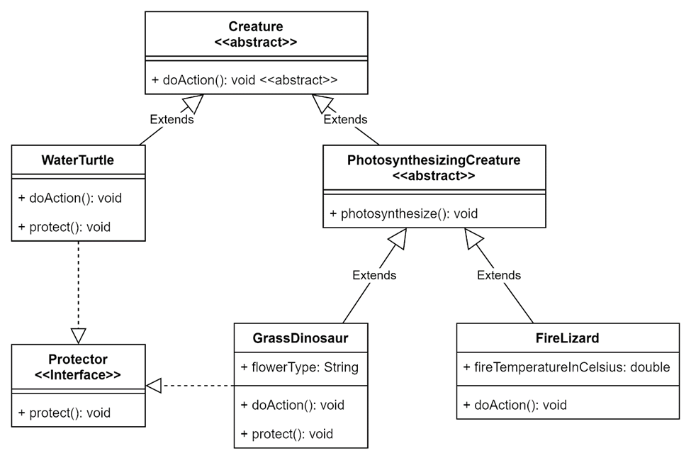

# Lab 5

## Overview

The primary objective of this assignment is to help you become familiar with the process of refactoring a large, non-cohesive Java class into a more modular and maintainable structure using abstract classes, interfaces, and subclasses.

This assignment is particularly designed to prepare you for the challenges you may encounter in your Project 2 assignment, where similar refactoring techniques will be required.

A UML diagram of the initial and final code for this lab is provided as an attachment to this assignment.

## Instructions

Complete all the following problems, step-by-step.

> [!NOTE]
> 
> For quizzes and exams, you will be expected to understand the content required to complete all problems without guidance.

### Problem 1: Create the Abstract PhotosynthesizingCreature Subclass

In `src`, create an abstract `PhotosynthesizingCreature` class that extends the `Creature` class.
Write a constructor that accepts values for all of the `Creature` class's instance variables to pass to the super constructor.
Move the `photosynthesize()` method from the `Creature` class into this class.

### Problem 2: Create Creature Subclasses

In `src`, create a `GrassDinosaur` class that extends the `PhotosynthesizingCreature` class.
Write a constructor that only accepts a value for the `Creature` class's `flowerType` instance variable.
This constructor will pass this value to the super constructor's `flowerType` parameter, and pass default values of `CreatureKind.GRASS_DINOSAUR` and `0.0` to the super constructor's `kind` and `fireTemperatureInCelsius` parameters, respectively.
In the `GrassDinosaur` class, override the `Creature` class's `doAction()` method by copying the original implementation, removing all functionality unrelated to `CreatureKind.GRASS_DINOSAUR`, and simplifying.
A single print statement will remain.

Create a `FireLizard` class that extends the `PhotosynthesizingCreature` class.
Write a constructor that only accepts a value for the `Creature` class's `fireTemperatureInCelsius` instance variable.
This constructor will pass this value to the super constructor's `fireTemperatureInCelsius` parameter, and pass default values of `CreatureKind.FIRE_LIZARD` and `null` to the super constructor's `kind` and `flowerType` parameters, respectively.
In the `FireLizard` class, override the `Creature` class's `doAction()` method by copying the original implementation, removing all functionality unrelated to `CreatureKind.FIRE_LIZARD`, and simplifying.
A single print statement will remain.

Simplify the `PhotosynthesizingCreature` class's `photosynthesize()` method by removing all code unrelated to `CreatureKind.GRASS_DINOSAUR` or `CreatureKind.FIRE_LIZARD`.
A single print statement will remain.

Create a `WaterTurtle` class that extends the `Creature` class.
Write a constructor that accepts no values and passes the default values of `CreatureKind.WATER_TURTLE`, `null`, and `0.0` to the super constructor for the `kind`, `flowerType`, and `fireTemperatureInCelsius` parameters, respectively.
In the `WaterTurtle` class, override the `Creature` class's `doAction()` method by copying the original implementation, removing all functionality unrelated to `CreatureKind.WATER_TURTLE`, and simplifying.
A single print statement will remain.

Refactor the `CreatureMain` class's main method to use the `GrassDinosaur`, `FireLizard`, and `WaterTurtle` constructors instead of the respective `createDinosaur`, `createLizard`, and `createTurtle` methods from the `Creature` class.
Remove the `createDinosaur`, `createLizard`, and `createTurtle` methods from the `Creature` class.
Additionally, comment out the `turtle.photosynthesize();` statement in `CreatureMain`.
Change the reference variable types ***or*** typecast the objects as necessary for the remaining `photosynthesize()` method calls to compile.
You may test that the `CreatureMain` class's main method retains the same functionality (outside the commented out line).

### Problem 3: The Protector Interface

In `src`, create a `Protector` interface that defines a single `void protect()` method.

Have the `GrassDinosaur` class implement the `Protector` interface.
In `GrassDinosaur` class, override the `protect()` method by copying the `Creature` class's implementation, removing all functionality unrelated to `CreatureKind.GRASS_DINOSAUR`, and simplifying.
A single print statement will remain.

Have the `WaterTurtle` class implement the `Protector` interface.
In `WaterTurtle`, override the protect method by copying the `Creature` class's implementation, removing all functionality unrelated to `CreatureKind.WATER_TURTLE`, and simplifying.
A single print statement will remain.
Remove the `protect()` method from the super `Creature` class.
Comment out the `lizard.protect();` statement in `CreatureMain`.
Change the reference variable types or typecast the objects as necessary for the remaining `protect()` method calls to compile.
You may test that the `CreatureMain` class's main method retains the same functionality (outside the commented out line).

### Problem 4: Abstracting the Creature Class

Make the `Creature` class abstract.

Convert the `Creature` class's `doAction()` method into an abstract method and remove its implementation.

Move the `flowerType` instance variable from the `Creature` class into the `GrassDinosaur` class. 
Remove the related parameter from all relevant constructors except for the `GrassDinosaur` class.
In the `GrassDinosaur` class, initialize the instance variable using this parameter.

Move the `fireTemperatureInCelsius` instance variable from the `Creature` class into the `FireLizard` class.
Remove the related parameter from all relevant constructors except for the `FireLizard` class.
In the `FireLizard` class, initialize the instance variable using this parameter.

Remove the `kind` instance variable from the `Creature` class.
Remove the related parameter from all relevant constructors.
Delete `CreatureKind.java`.
You may remove the `Creature` class's constructor and any subclass super calls to it.
You may also remove the now empty `PhotosynthesizingCreature` and `WaterTurtle` classes’ constructors.

Test that the `CreatureMain` class's main method retains the same functionality.

## UML Diagrams

### Initial UML Diagram

### Final UML Diagram

## Submission

> [!Warning]
> 
> Submitting this assignment confirms that you did not use solutions or code from external, AI-generated, or peer sources.
> You also agree to have your code checked by standard plagiarism detection software.
> Violation will result in a grade of zero, a report to the University, and further potential action.

Commit and push your repository changes to GitHub.

On Canvas, upload a screenshot of your `src` folder on GitHub showing proof of your submission. **Your repository name must be visible.**