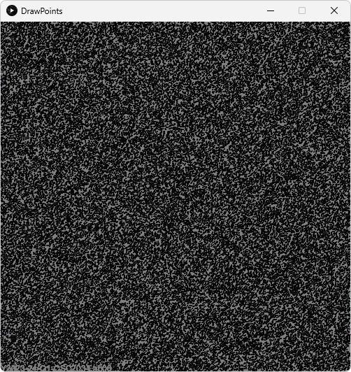

[](https://classroom.github.com/a/SzeNyOYb)
# Lab 6

## Overview

This lab explores streams through the implementation of a program to read in a set of numbers (representing points, specifically an image composed primarily of noise).

Through implementing various computational operations on these points they are transformed into a more coherent image (composed of points).

## Instructions

The included `positions.txt` file contains x-, y-, and z-coordinate date for a large number of 3-dimensional points.
The `DrawPoints` class will iterate over a list of such points to produce a 2-dimensional image.

You will modify the `DrawPoints` class's `draw()` method to read this point data into `Point` objects, manipulate it using streams, and then convert it to a list.

Complete **all** the following problems in order.

> [!NOTE]
> 
> For quizzes and exams, you will be expected to understand the content required to complete all problems without guidance.

### Problem 1: Read in Points

In `src/DrawPoints.java` under the relevant `TODO` comments, you will modify file handling behavior to parse data from `positions.txt`.
As is, the program opens the file and iterates over each line and stores it as a string using the variable `line`.

You will need extract the x, y, and z information from the line (this should be done in a similar way to Project 1).
You should then create a `Point` object using this information and place it in a `List` or `StreamBuilder`.
You must initialize the list/builder outside the loop.

### Problem 2: Manipulate Points

In `src/DrawPoints.java` under the relevant `TODO` comments, you will create a stream of `Point` objects using your list or stream builder from Problem 1.

After doing so, you will add operations to perform on the stream before conversion with the `Stream.toList()` method.

You must perform the following operations using `map()` and `filter()` methods:
1. Remove all points with a `z` value greater than `2.0`.
2. Scale each point's position by `0.5`.
3. Translate all points by (-150.0, -562.0, 0).
4. Negate the y coordinate.

### Problem 3: Display Points

Run `src/DrawPoint.java` to display your transformed points.
Without transformation, the image displayed will be random noise.
**A drawing of spirals and insects will be displayed when all operations are successfully completed.**

> [!IMPORTANT]
> 
> You will submit a screenshot of this drawing in addition to your regular submission screenshot.

## Untransformed Image



## The Beginning of positions.txt

```
564.0, 414.0, 1
564.2765, 414.44946, 1
564.5011, 414.95673, 1
564.6649, 415.51572, 1
564.7596, 416.1191, 1
...
```

## Validation

GitHub will not display a checkmark.
The display of the insect drawing described above will serve as your validation.

## Submission

> [!Warning]
> 
> Submitting this assignment confirms that you did not use solutions or code from external, AI-generated, or peer sources.
>
> You also agree to have your code checked by standard plagiarism detection software.
>
> Violation will result in a grade of zero, a report to the University, and further potential action.

Commit and push your repository changes to GitHub.

You must submit the following screenshots to Canvas for completion:
- A screenshot of your `src` folder on GitHub as proof of your submission. **Your repository name must be visible.**
- A screenshot of the image displayed upon successful stream manipulation.